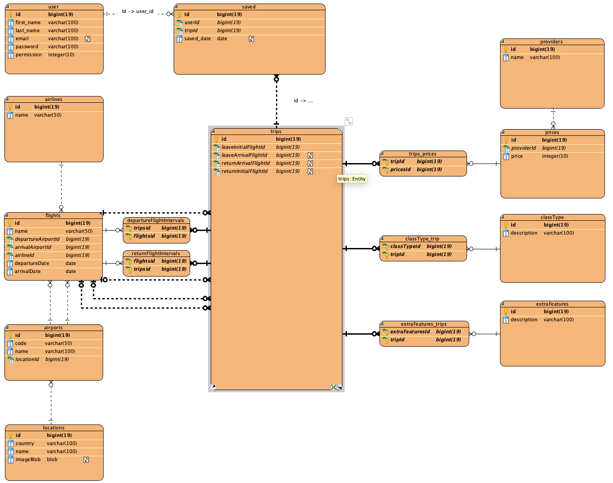

# IDATA2306 Application Development
This is the backend of our Flight Price Aggregator exam project. 

## Getting started.
To get started you need:
* Java version 21
* An IDE
* Docker

You first need to set up a local database so the application can connect to, we use docker for this.
Run the following command:
```
docker-compose up
```
Now you can use maven to run your project.


## Backend REST API
Here are links to the local swagger documentation when run locally on your machine. Development swagger documentation witch is used to test 
before going to production. And lastly Production witch is the main application that gets interacted with.

| Swagger documentation | Link                                                                      |
|-----------------------|---------------------------------------------------------------------------|
| Local                 | [Local-Swagger](http://localhost:8080/swagger-ui/index.html#/)            |
| Development           | [Dev-Swagger](https://dev-api.flightfinder.space/swagger-ui/index.html#/) |
| Production            | [Prod-Swagger](https://api.flightfinder.space/swagger-ui/index.html#/)    |


## Database design
Later on we have added in a table for "Roles", and made small changes here and there.

Prod and Dev have each a database with a user that only have access to that database. They have their password
stored in the kubernetes as secrets, same with the JWT secret.

## CI/CD pipeline explained.
You work on the project locally, when you push or merge with dev or prod branch it triggers a GitHub action/workflow.
This workflow first starts a local mysql server where we can build the maven project. This is because we need a database
connection to test out jpa without it crashing. The same workflow also dockerized the maven project and the image gets uploaded
to our public [Docker Hub](https://hub.docker.com/repositories/danielneset). We could have made them private, but one can only have
1 free private repository. Here we manually need to go to [Argo-CD repo](https://github.com/ADNTNU/argocd-config) to insert the new
image we want to use. The positive side with this is if someone pushes something to main, it doesn't automatically get pushed to 
production. On the server we use Kubernetes with Argo-CD to handle our applications, deployments, services, secrets and other. 
Here we have connected it to the [Argo-CD repo](https://github.com/ADNTNU/argocd-config) and it can fetch the new files form the
repo and put them in dev or production.

The savedController give a normal user access to get save and delete it stuff.
To avoid user deleting other users stuff, we add authentifisering. So a user
that is signed in cannot change others value